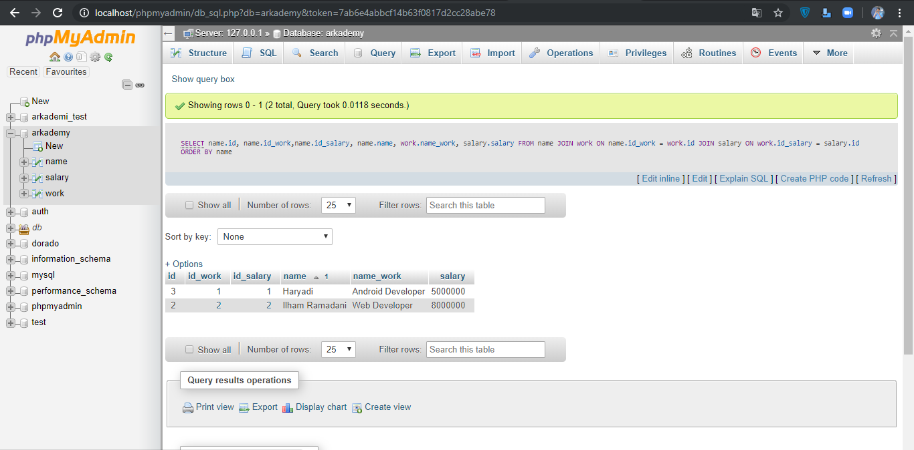

###################
TEST ARKADEMI
###################

Berikut Merupakan Penjelasan Dari Soal Yang Diberikan.

*******************
Soal 1
*******************

Kegunaan JSON adalah untuk memudahkan data untuk saling bertukaran antar platform,
karena syntax JSON bisa digunakan ke banyak bahasa dan platform. 
**************************
Soal 7
**************************
Aplikasi Pendukung
- Web Sever (XAMPP)

Instalasi
- Buat Database arkademy
- Import SQL arkademy.sql Kedalam Database
- Jalankan Website

*******************
Screen Shot Aplikasi
*******************
Tampilan SQL Database 
**************************

**************************
Tampilan HOME (View)
**************************

**************************
Tampilan Insert
**************************

**************************
Tampilan Succes Insert
**************************

**************************
Tampilan Edit
**************************

**************************
Tampilan Success Edit
**************************

**************************
Tampilan Delete
**************************

**************************
Tampilan Success Delete
**************************

**************************